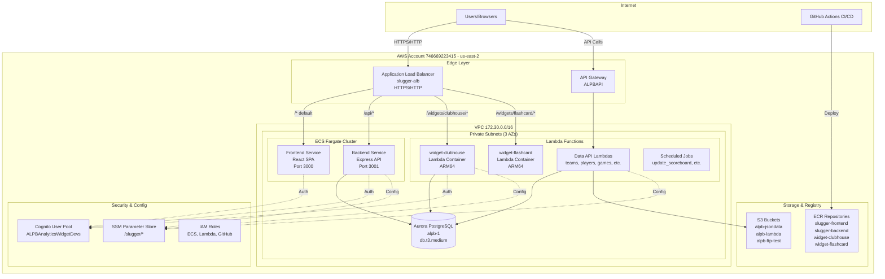
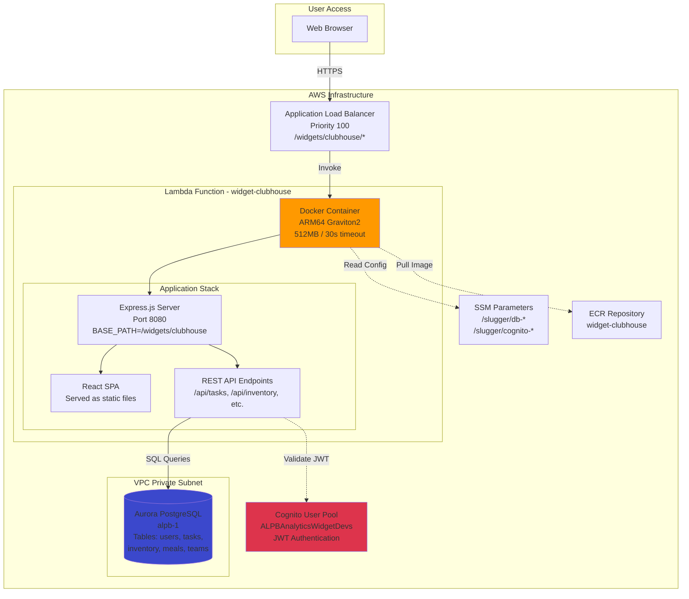
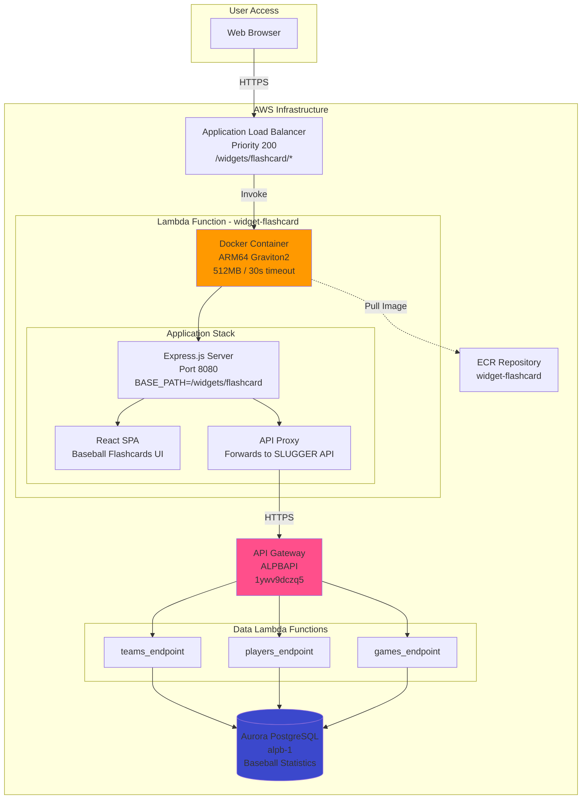
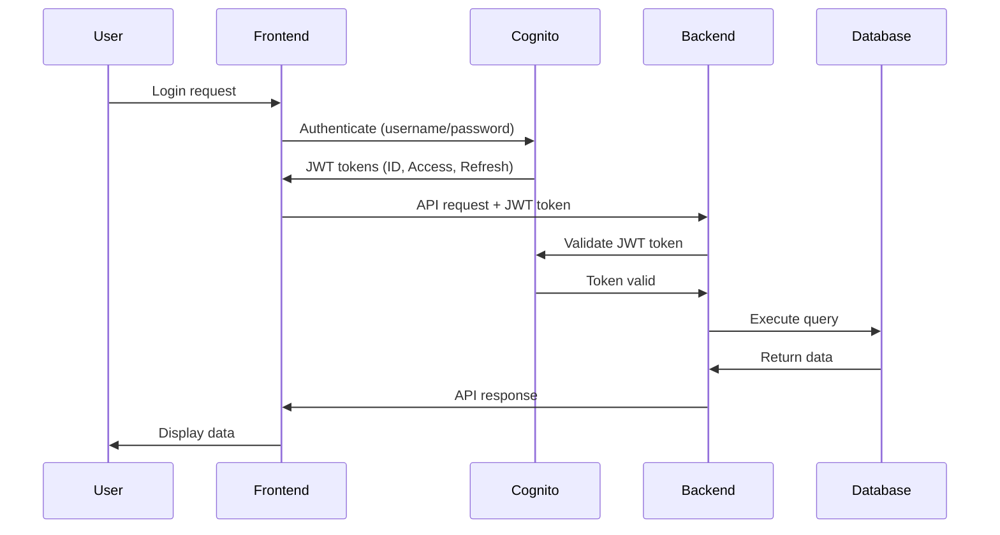

# SLUGGER AWS Architecture - Complete Documentation

**Account ID**: `746669223415`  
**Region**: `us-east-2` (US East - Ohio)  
**Last Updated**: February 11, 2026  
**Status**: Production Active

---

## Executive Summary

The SLUGGER application is a comprehensive baseball analytics platform deployed on AWS, consisting of:
- Main web application (frontend + backend) running on ECS Fargate
- Two embedded widget applications (Clubhouse, Flashcard) running on Lambda
- Data processing pipeline with scheduled Lambda functions
- Aurora PostgreSQL database for persistent storage
- API Gateway for external API access
- S3 storage for JSON data and Lambda packages

---

## High-Level Architecture



---

## Core Infrastructure Components

### 1. Application Load Balancer (ALB)

| Property | Value |
|----------|-------|
| Name | `slugger-alb` |
| ARN | `arn:aws:elasticloadbalancing:us-east-2:746669223415:loadbalancer/app/slugger-alb/09d85a00869374c7` |
| DNS Name | `slugger-alb-1518464736.us-east-2.elb.amazonaws.com` |
| State | Active |
| Type | Application |
| Scheme | Internet-facing |

**Listeners:**
- Port 443 (HTTPS) - Primary production traffic
- Port 80 (HTTP) - Redirects or direct access

**Routing Rules (Priority Order):**

| Priority | Path Pattern | Target | Type |
|----------|-------------|--------|------|
| 1 | `/api/*` | `slugger-backend-tg` | ECS Fargate |
| 100 | `/widgets/clubhouse/*` | `tg-widget-clubhouse` | Lambda |
| 200 | `/widgets/flashcard/*` | `tg-widget-flashcard` | Lambda |
| default | `/*` | `slugger-frontend-tg` | ECS Fargate |

**Purpose:** Central entry point for all HTTP/HTTPS traffic, routing requests to appropriate backend services based on URL path patterns.

---

### 2. ECS Fargate Cluster

| Property | Value |
|----------|-------|
| Cluster Name | `slugger-cluster` |
| Status | ACTIVE |
| Running Tasks | 2 |
| Active Services | 2 |
| Capacity Provider | AWS Fargate |

#### Frontend Service

| Property | Value |
|----------|-------|
| Service Name | `slugger-frontend-service` |
| Task Definition | `slugger-frontend:15` |
| Desired Count | 1 |
| Running Count | 1 |
| CPU | 512 (0.5 vCPU) |
| Memory | 1024 MB |
| Port | 3000 |
| Image | `746669223415.dkr.ecr.us-east-2.amazonaws.com/slugger-frontend:latest` |

**Purpose:** Serves the React-based single-page application (SPA) for the main SLUGGER web interface.

#### Backend Service

| Property | Value |
|----------|-------|
| Service Name | `slugger-backend-service` |
| Task Definition | `slugger-backend:23` |
| Desired Count | 1 |
| Running Count | 1 |
| CPU | 512 (0.5 vCPU) |
| Memory | 1024 MB |
| Port | 3001 |
| Image | `746669223415.dkr.ecr.us-east-2.amazonaws.com/slugger-backend:latest` |

**Purpose:** Express.js API server handling business logic, database operations, and authentication for the main application.

---

### 3. Widget Lambda Functions

#### Clubhouse Widget

| Property | Value |
|----------|-------|
| Function Name | `widget-clubhouse` |
| ARN | `arn:aws:lambda:us-east-2:746669223415:function:widget-clubhouse` |
| Package Type | Container Image |
| Architecture | ARM64 (Graviton2) |
| Memory | 512 MB |
| Timeout | 30 seconds |
| Runtime | Container (Node.js + React) |
| Last Modified | 2026-02-02 |
| ECR Image | `746669223415.dkr.ecr.us-east-2.amazonaws.com/widget-clubhouse:latest` |
| VPC Enabled | Yes (Private subnets) |
| Security Group | `sg-0c985525970ae7372` (ECS tasks SG) |

**Environment Variables:**
- `PORT`: 8080
- `BASE_PATH`: /widgets/clubhouse
- `COGNITO_USER_POOL_ID`: us-east-2_tG7IQQ6G7
- `COGNITO_CLIENT_ID`: 6cttafm6nkv17saapu58a5gdns
- `DB_HOST`: alpb-1.cluster-cx866cecsebt.us-east-2.rds.amazonaws.com
- `DB_NAME`: postgres
- `DB_USER`: postgres

**Purpose:** Team management widget providing clubhouse functionality - task management, inventory tracking, meal planning, and team coordination features. Deployed as a containerized Lambda function with full-stack Express.js backend and React frontend.

**Access URL:** `https://slugger-alb-1518464736.us-east-2.elb.amazonaws.com/widgets/clubhouse`

---

#### Flashcard Widget

| Property | Value |
|----------|-------|
| Function Name | `widget-flashcard` |
| ARN | `arn:aws:lambda:us-east-2:746669223415:function:widget-flashcard` |
| Package Type | Container Image |
| Architecture | ARM64 (Graviton2) |
| Memory | 512 MB |
| Timeout | 30 seconds |
| Runtime | Container (Node.js + React) |
| Last Modified | 2025-12-08 |
| ECR Image | `746669223415.dkr.ecr.us-east-2.amazonaws.com/widget-flashcard:latest` |
| VPC Enabled | Yes (Private subnets) |
| Security Group | `sg-0c985525970ae7372` (ECS tasks SG) |

**Environment Variables:**
- `PORT`: 8080
- `BASE_PATH`: /widgets/flashcard
- `SLUGGER_API_URL`: https://1ywv9dczq5.execute-api.us-east-2.amazonaws.com/ALPBAPI

**Purpose:** Baseball player flashcard widget for studying player statistics and information. Consumes data from the SLUGGER API Gateway rather than direct database access.

**Access URL:** `https://slugger-alb-1518464736.us-east-2.elb.amazonaws.com/widgets/flashcard`

---

### 4. Database - Aurora PostgreSQL

| Property | Value |
|----------|-------|
| Cluster Identifier | `alpb-1` |
| Engine | aurora-postgresql |
| Status | available |
| Writer Endpoint | `alpb-1.cluster-cx866cecsebt.us-east-2.rds.amazonaws.com` |
| Reader Endpoint | `alpb-1.cluster-ro-cx866cecsebt.us-east-2.rds.amazonaws.com` |
| Instance | `alpb-1-instance-1` |
| Instance Class | db.t3.medium |
| Storage | Aurora Serverless Storage (auto-scaling) |
| Multi-AZ | Yes |

**Purpose:** Central PostgreSQL database storing all application data including:
- User accounts and authentication data
- Baseball statistics (teams, players, games, pitches)
- Clubhouse widget data (tasks, inventory, meals, teams)
- Application configuration and metadata

**Connections:**
- ECS Backend Service (slugger-backend)
- Clubhouse Widget Lambda
- Data API Lambda functions (teams_endpoint, players_endpoint, etc.)

---

### 5. API Gateway

| Property | Value |
|----------|-------|
| API Name | `ALPBAPI` |
| API ID | `1ywv9dczq5` |
| Type | REST API |
| Endpoint | `https://1ywv9dczq5.execute-api.us-east-2.amazonaws.com/ALPBAPI` |
| Created | 2024-09-19 |

**Purpose:** Provides RESTful API access to baseball data through Lambda function integrations. Used by:
- Flashcard widget for player/team data
- External integrations
- Mobile applications (if any)

**Integrated Lambda Functions:**
- `teams_endpoint` - Team information and rosters
- `players_endpoint` - Player statistics and profiles
- `games_endpoint` - Game schedules and results
- `pitches_endpoint` - Pitch-by-pitch data
- `ballpark_endpoint` - Ballpark information
- `validate_token_endpoint` - JWT token validation

---

### 6. Lambda Functions - Data Processing

#### API Endpoint Functions

| Function Name | Runtime | Purpose | Last Modified |
|---------------|---------|---------|---------------|
| `teams_endpoint` | python3.11 | Team data API | 2025-04-28 |
| `players_endpoint` | python3.11 | Player statistics API | 2025-03-06 |
| `games_endpoint` | python3.11 | Game schedules/results API | 2025-03-05 |
| `pitches_endpoint` | python3.11 | Pitch-by-pitch data API | 2025-03-06 |
| `ballpark_endpoint` | python3.11 | Ballpark information API | 2025-03-05 |
| `validate_token_endpoint` | nodejs22.x | JWT token validation | 2025-04-11 |

#### Scheduled Job Functions

| Function Name | Runtime | Purpose | Schedule | Last Modified |
|---------------|---------|---------|----------|---------------|
| `update_scoreboard` | nodejs24.x | Updates live game scores | EventBridge | 2025-12-16 |
| `update_standings` | nodejs22.x | Updates team standings | EventBridge | 2025-04-24 |
| `update_league_leaders` | nodejs22.x | Updates statistical leaders | EventBridge | 2025-04-24 |
| `widget_metrics_job` | python3.11 | Collects widget usage metrics | EventBridge | 2025-04-24 |

#### Data Ingestion Functions

| Function Name | Runtime | Purpose | Last Modified |
|---------------|---------|---------|---------------|
| `trackman_ftp` | python3.13 | Ingests Trackman data from FTP | 2025-04-24 |
| `ProcessTrackmanStack-DockerFunc*` | Container | Processes Trackman CSV files | 2025-10-23 |

**Purpose:** These Lambda functions handle:
- Real-time data updates from external sources
- Scheduled data processing and aggregation
- API endpoints for data retrieval
- Data transformation and loading

---

### 7. Container Registry (ECR)

| Repository Name | Purpose | Image Count |
|----------------|---------|-------------|
| `slugger-frontend` | Frontend React application | Multiple tags |
| `slugger-backend` | Backend Express.js API | Multiple tags |
| `widget-clubhouse` | Clubhouse widget container | Multiple tags |
| `widget-flashcard` | Flashcard widget container | Multiple tags |
| `cdk-hnb659fds-container-assets-*` | CDK deployment assets | Multiple |
| `cdk-accel-container-assets-*` | CDK accelerator assets | Multiple |

**Purpose:** Stores Docker container images for ECS services and Lambda functions. Images are built by GitHub Actions CI/CD pipeline and pulled by ECS/Lambda during deployment.

---

### 8. Storage (S3)

| Bucket Name | Purpose | Size |
|-------------|---------|------|
| `alpb-jsondata` | JSON data storage for baseball statistics | ~408 KB |
| `alpb-lambda` | Lambda deployment packages and artifacts | Variable |
| `alpb-ftp-test` | FTP test data for Trackman ingestion | Variable |

**Purpose:** 
- `alpb-jsondata`: Stores processed JSON files for quick data access
- `alpb-lambda`: Stores Lambda function deployment packages
- `alpb-ftp-test`: Staging area for FTP data ingestion testing

---

### 9. Authentication & Authorization (Cognito)

| Property | Value |
|----------|-------|
| User Pool Name | `ALPBAnalyticsWidgetDevs` |
| User Pool ID | `us-east-2_tG7IQQ6G7` |
| App Client ID | `6cttafm6nkv17saapu58a5gdns` |
| Region | us-east-2 |

**Purpose:** Provides user authentication and authorization for:
- Main SLUGGER application
- Clubhouse widget
- API Gateway endpoints (via JWT validation)

**Features:**
- User registration and login
- JWT token generation and validation
- Password policies and MFA support
- User attribute management

---

### 10. Configuration Management (SSM Parameter Store)

| Parameter Path | Type | Purpose |
|----------------|------|---------|
| `/slugger/api-url` | String | API Gateway URL |
| `/slugger/frontend-url` | String | Frontend application URL |
| `/slugger/lambda-api-base-url` | String | Lambda API base URL |
| `/slugger/cognito-user-pool-id` | SecureString | Cognito User Pool ID |
| `/slugger/cognito-app-client-id` | SecureString | Cognito App Client ID |
| `/slugger/cognito-app-client-id-public` | String | Public Cognito Client ID |
| `/slugger/db-host` | SecureString | Aurora database endpoint |
| `/slugger/db-name` | SecureString | Database name |
| `/slugger/db-username` | SecureString | Database username |
| `/slugger/db-password` | SecureString | Database password |
| `/slugger/db-port` | String | Database port (5432) |
| `/slugger/clubhouse/db-password` | SecureString | Clubhouse widget DB password |
| `/slugger/jwt-secret` | SecureString | JWT signing secret |
| `/slugger/token-secret` | SecureString | Token encryption secret |
| `/slugger/session-secret` | SecureString | Session encryption secret |
| `/slugger/json-bucket-name` | String | S3 bucket for JSON data |
| `/slugger/pointstreak-base` | String | Pointstreak API base URL |
| `/slugger/usage-plan-id` | String | API Gateway usage plan ID |

**Purpose:** Centralized configuration management for all services, providing secure storage for sensitive credentials and easy configuration updates without code changes.

---

### 11. Networking (VPC)

| Property | Value |
|----------|-------|
| VPC ID | `vpc-030c8d613fc104199` |
| CIDR Block | `172.30.0.0/16` |
| Region | us-east-2 |

#### Subnets

| Subnet ID | Availability Zone | CIDR Block | Type |
|-----------|-------------------|------------|------|
| `subnet-00b1945e1c7f15475` | us-east-2a | 172.30.0.0/24 | Private |
| `subnet-0ea95576538bbc82b` | us-east-2b | 172.30.1.0/24 | Private |
| `subnet-0b9ca73e2fdfde13d` | us-east-2c | 172.30.2.0/24 | Private |

**Note:** All compute resources (ECS tasks, Lambda functions) run in private subnets for security. Internet access is provided via NAT Gateway.

#### Security Groups

| Name | ID | Purpose | Inbound Rules |
|------|----|---------|---------------|
| `slugger-alb-sg` | `sg-0c35c445084f80855` | ALB security group | 80/HTTP, 443/HTTPS from 0.0.0.0/0 |
| `slugger-ecs-tasks-sg` | `sg-0c985525970ae7372` | ECS tasks and Lambda VPC | 3000, 3001 from ALB SG; 5432 to Aurora |

**Purpose:** Network isolation and security controls for all AWS resources. Private subnets ensure compute resources are not directly accessible from the internet.

---

### 12. IAM Roles

| Role Name | ARN | Purpose |
|-----------|-----|---------|
| `slugger-ecs-execution` | `arn:aws:iam::746669223415:role/slugger-ecs-execution` | ECS task execution (ECR pull, CloudWatch logs, SSM access) |
| `slugger-backend-task` | `arn:aws:iam::746669223415:role/slugger-backend-task` | Backend runtime permissions (S3, Cognito, SSM) |
| `slugger-frontend-task` | `arn:aws:iam::746669223415:role/slugger-frontend-task` | Frontend runtime permissions (minimal) |
| `lambda-widget-clubhouse` | `arn:aws:iam::746669223415:role/lambda-widget-clubhouse` | Clubhouse Lambda execution (VPC, logs, SSM, Aurora) |
| `lambda-widget-flashcard` | `arn:aws:iam::746669223415:role/lambda-widget-flashcard` | Flashcard Lambda execution (VPC, logs) |
| `github-actions-deploy` | `arn:aws:iam::746669223415:role/github-actions-deploy` | GitHub Actions OIDC deployment role |

**Purpose:** Implements least-privilege access control for all services. Each role has specific permissions tailored to its service's requirements.

---

### 13. Monitoring (CloudWatch)

#### Log Groups

| Log Group | Purpose | Retention | Size |
|-----------|---------|-----------|------|
| `/ecs/slugger-backend` | Backend service logs | 14 days | ~408 KB |
| `/ecs/slugger-frontend` | Frontend service logs | 14 days | ~398 KB |
| `/aws/lambda/widget-clubhouse` | Clubhouse widget logs | 14 days | Variable |
| `/aws/lambda/widget-flashcard` | Flashcard widget logs | 14 days | Variable |
| `/aws/lambda/teams_endpoint` | Teams API logs | 14 days | Variable |
| `/aws/lambda/players_endpoint` | Players API logs | 14 days | Variable |
| (Additional Lambda log groups) | Various Lambda functions | 14 days | Variable |

**Purpose:** Centralized logging for all services, enabling debugging, monitoring, and audit trails.

---

## Widget-Specific Architecture

### Clubhouse Widget Architecture



**Key Features:**
- Full-stack application in a single Lambda container
- Direct database access for low latency
- JWT-based authentication via Cognito
- Task management, inventory tracking, meal planning
- Team coordination and game scheduling

**Database Tables:**
- `users` - User accounts and profiles
- `tasks` - Task management with repeating task support
- `inventory` - Team-based inventory tracking
- `meals` - Meal planning and scheduling
- `teams` - Team information and rosters
- `games` - Game schedules

---

### Flashcard Widget Architecture



**Key Features:**
- Stateless widget consuming external API
- No direct database access (uses API Gateway)
- Interactive flashcard interface for player statistics
- Date range filtering for game data
- Team and player information display

**API Endpoints Used:**
- `GET /teams/range?startDate=YYYYMMDD&endDate=YYYYMMDD` - Team data
- `GET /players` - Player statistics
- `GET /games` - Game schedules and results

**Design Pattern:** API Gateway integration pattern - widget acts as a frontend proxy to centralized data APIs, promoting separation of concerns and reusability.

---

## Data Flow Patterns

### 1. User Request Flow (Main Application)

```
User Browser
    ↓ HTTPS
Application Load Balancer (slugger-alb)
    ↓ Path: /*
ECS Frontend Service (React SPA)
    ↓ API calls to /api/*
Application Load Balancer
    ↓ Path: /api/*
ECS Backend Service (Express.js)
    ↓ SQL queries
Aurora PostgreSQL (alpb-1)
```

### 2. Widget Request Flow (Clubhouse)

```
User Browser
    ↓ HTTPS
Application Load Balancer (slugger-alb)
    ↓ Path: /widgets/clubhouse/*
Lambda Function (widget-clubhouse)
    ├─→ Serve React SPA (static files)
    └─→ API endpoints (/api/*)
        ↓ SQL queries
Aurora PostgreSQL (alpb-1)
```

### 3. Widget Request Flow (Flashcard)

```
User Browser
    ↓ HTTPS
Application Load Balancer (slugger-alb)
    ↓ Path: /widgets/flashcard/*
Lambda Function (widget-flashcard)
    ├─→ Serve React SPA (static files)
    └─→ Proxy API requests
        ↓ HTTPS
API Gateway (ALPBAPI)
    ↓ Invoke
Lambda Functions (teams_endpoint, players_endpoint, etc.)
    ↓ SQL queries
Aurora PostgreSQL (alpb-1)
```

### 4. Scheduled Data Update Flow

```
EventBridge Rule (Cron schedule)
    ↓ Trigger
Lambda Function (update_scoreboard, update_standings, etc.)
    ├─→ Fetch external data (Pointstreak API)
    ├─→ Process and transform data
    └─→ Update database
        ↓ SQL INSERT/UPDATE
Aurora PostgreSQL (alpb-1)
```

### 5. Data Ingestion Flow (Trackman)

```
External FTP Server (Trackman)
    ↓ FTP pull
Lambda Function (trackman_ftp)
    ↓ Upload CSV
S3 Bucket (alpb-ftp-test)
    ↓ S3 event trigger
Lambda Function (ProcessTrackmanStack-DockerFunc)
    ├─→ Parse CSV files
    ├─→ Transform data
    └─→ Load to database
        ↓ SQL INSERT
Aurora PostgreSQL (alpb-1)
```

### 6. CI/CD Deployment Flow

```
Developer Push to GitHub (main branch)
    ↓ Trigger
GitHub Actions Workflow
    ├─→ Build Docker images
    ├─→ Run tests
    └─→ Authenticate with AWS (OIDC)
        ↓ Push images
ECR Repositories
    ↓ Update services
ECS Services / Lambda Functions
    └─→ Pull new images and restart
```

---

## Security Architecture

### Authentication Flow



### Security Layers

1. **Network Security**
   - VPC isolation with private subnets
   - Security groups restricting traffic
   - No direct internet access to compute resources
   - ALB as single entry point

2. **Application Security**
   - JWT-based authentication via Cognito
   - Token validation on every API request
   - HTTPS/TLS encryption in transit
   - Secrets stored in SSM Parameter Store (encrypted)

3. **Database Security**
   - Aurora in private subnet (no public access)
   - Security group allowing only ECS/Lambda access
   - Encrypted at rest
   - Encrypted in transit (SSL/TLS)

4. **IAM Security**
   - Least-privilege IAM roles
   - Service-specific permissions
   - No long-term credentials (OIDC for CI/CD)
   - Regular credential rotation

5. **Container Security**
   - ECR image scanning on push
   - Base images regularly updated
   - No secrets in container images
   - Runtime secrets from SSM

---

## Cost Breakdown (Estimated Monthly)

| Service | Resource | Estimated Cost |
|---------|----------|----------------|
| **ECS Fargate** | 2 tasks × 0.5 vCPU × 1 GB × 730 hrs | ~$35-40 |
| **Aurora PostgreSQL** | db.t3.medium × 1 instance | ~$70-80 |
| **Lambda (Widgets)** | 2 functions × 100k invocations | ~$4-8 |
| **Lambda (Data APIs)** | 6 functions × 50k invocations | ~$3-5 |
| **Lambda (Scheduled)** | 4 functions × 10k invocations | ~$1-2 |
| **ALB** | 1 ALB + data transfer | ~$20-25 |
| **API Gateway** | 100k requests | ~$0.35 |
| **ECR** | 6 repositories × storage | ~$3-5 |
| **S3** | 3 buckets × storage + requests | ~$2-3 |
| **CloudWatch Logs** | Log storage + ingestion | ~$5-10 |
| **Cognito** | User pool + MAU | ~$0-5 |
| **SSM Parameter Store** | Standard parameters | Free |
| **VPC** | NAT Gateway + data transfer | ~$35-45 |
| **Data Transfer** | Outbound internet traffic | ~$10-20 |
| **Total** | | **~$188-248/month** |

**Cost Optimization Opportunities:**
- Use Aurora Serverless v2 for auto-scaling
- Implement Lambda reserved concurrency for predictable workloads
- Enable S3 lifecycle policies for old data
- Use CloudWatch Logs retention policies
- Consider Savings Plans for ECS Fargate

---

## Deployment Architecture

### Infrastructure as Code

| Tool | Purpose | Location |
|------|---------|----------|
| Terraform | Widget Lambda deployment | `infrastructure/widgets/clubhouse/`, `infrastructure/widgets/flashcard/` |
| AWS CDK | Trackman processing pipeline | (CDK stacks) |
| GitHub Actions | CI/CD automation | `.github/workflows/` |

### Deployment Strategies

#### ECS Services (Frontend/Backend)
- **Strategy:** Rolling update
- **Process:** GitHub Actions → Build Docker → Push to ECR → Update ECS service
- **Rollback:** Revert to previous task definition
- **Zero-downtime:** Yes (ALB health checks)

#### Lambda Widgets
- **Strategy:** All-at-once
- **Process:** GitHub Actions → Build Docker → Push to ECR → Update Lambda function code
- **Rollback:** Revert to previous image tag
- **Cold start:** ~2-3 seconds (container Lambda)

#### Lambda Data APIs
- **Strategy:** All-at-once
- **Process:** Manual deployment or CI/CD → Upload ZIP to S3 → Update function code
- **Rollback:** Revert to previous version
- **Cold start:** ~500ms-1s (Python/Node.js)

---

## Monitoring & Observability

### Health Checks

| Service | Endpoint | Expected Response |
|---------|----------|-------------------|
| Frontend | `GET /` | 200 OK (HTML) |
| Backend | `GET /api/health` | 200 OK (JSON) |
| Clubhouse Widget | `GET /widgets/clubhouse/api/health` | 200 OK (JSON) |
| Flashcard Widget | `GET /widgets/flashcard/api/health` | 200 OK (JSON) |

### Metrics to Monitor

1. **Application Metrics**
   - Request count and latency (ALB metrics)
   - Error rates (4xx, 5xx responses)
   - Lambda invocation count and duration
   - Lambda cold start frequency

2. **Infrastructure Metrics**
   - ECS CPU and memory utilization
   - Aurora CPU, memory, connections
   - Lambda concurrent executions
   - ALB target health status

3. **Business Metrics**
   - Active users (Cognito)
   - Widget usage (custom metrics)
   - API request patterns
   - Data freshness (last update timestamp)

### Alerting Recommendations

- ALB 5xx error rate > 5%
- ECS task failure or restart
- Lambda error rate > 1%
- Aurora CPU > 80%
- Aurora connections > 80% of max
- Lambda throttling events
- API Gateway 5xx errors

---

## Disaster Recovery & Business Continuity

### Backup Strategy

| Resource | Backup Method | Frequency | Retention |
|----------|---------------|-----------|-----------|
| Aurora PostgreSQL | Automated snapshots | Daily | 7 days |
| Aurora PostgreSQL | Manual snapshots | On-demand | Indefinite |
| ECR Images | Image retention | N/A | All tags kept |
| S3 Buckets | Versioning enabled | Continuous | 30 days |
| SSM Parameters | Manual export | Monthly | Version history |

### Recovery Objectives

- **RTO (Recovery Time Objective):** 2-4 hours
- **RPO (Recovery Point Objective):** 24 hours (daily Aurora snapshots)

### Disaster Recovery Procedures

1. **Database Failure**
   - Restore from latest Aurora snapshot
   - Update SSM parameters with new endpoint
   - Restart ECS services and Lambda functions

2. **Region Failure**
   - No multi-region setup currently
   - Manual failover required
   - Restore from snapshots in alternate region

3. **Application Failure**
   - Rollback to previous ECS task definition
   - Rollback to previous Lambda image tag
   - Check CloudWatch logs for root cause

---

## Operational Procedures

### Common Operations

#### Force Redeploy ECS Services
```bash
aws ecs update-service --cluster slugger-cluster \
  --service slugger-backend-service \
  --force-new-deployment --region us-east-2

aws ecs update-service --cluster slugger-cluster \
  --service slugger-frontend-service \
  --force-new-deployment --region us-east-2
```

#### Update Lambda Widget
```bash
# Build and push new image
docker build --platform linux/arm64 -t widget-clubhouse .
docker tag widget-clubhouse:latest \
  746669223415.dkr.ecr.us-east-2.amazonaws.com/widget-clubhouse:latest
docker push 746669223415.dkr.ecr.us-east-2.amazonaws.com/widget-clubhouse:latest

# Update Lambda function
aws lambda update-function-code \
  --function-name widget-clubhouse \
  --image-uri 746669223415.dkr.ecr.us-east-2.amazonaws.com/widget-clubhouse:latest \
  --region us-east-2
```

#### View Logs
```bash
# ECS logs
aws logs tail /ecs/slugger-backend --follow --region us-east-2
aws logs tail /ecs/slugger-frontend --follow --region us-east-2

# Lambda logs
aws logs tail /aws/lambda/widget-clubhouse --follow --region us-east-2
aws logs tail /aws/lambda/widget-flashcard --follow --region us-east-2
```

#### Check Service Health
```bash
# ECS services
aws ecs describe-services --cluster slugger-cluster \
  --services slugger-frontend-service slugger-backend-service \
  --region us-east-2 \
  --query 'services[*].{name:serviceName,status:status,running:runningCount}'

# Lambda functions
aws lambda get-function --function-name widget-clubhouse --region us-east-2
aws lambda get-function --function-name widget-flashcard --region us-east-2

# Aurora database
aws rds describe-db-clusters --db-cluster-identifier alpb-1 --region us-east-2
```

#### Update SSM Parameters
```bash
# Update a parameter
aws ssm put-parameter \
  --name "/slugger/db-password" \
  --value "NEW_PASSWORD" \
  --type SecureString \
  --overwrite \
  --region us-east-2

# Get a parameter
aws ssm get-parameter \
  --name "/slugger/db-host" \
  --with-decryption \
  --region us-east-2
```

---

## Architecture Evolution

### Phase 1: Initial Deployment (2024 Q3-Q4)
- ECS Fargate for main application
- Aurora PostgreSQL database
- Basic Lambda functions for data APIs
- API Gateway for external access
- Manual deployments

### Phase 2: Widget Integration (2025 Q4 - 2026 Q1)
- Clubhouse widget deployed as Lambda container
- Flashcard widget deployed as Lambda container
- ALB routing rules for widget paths
- Terraform infrastructure as code for widgets
- GitHub Actions CI/CD automation

### Phase 3: Current State (2026 Q1)
- 2 ECS services (frontend, backend)
- 2 widget Lambda functions (clubhouse, flashcard)
- 12+ data processing Lambda functions
- Scheduled jobs via EventBridge
- Comprehensive monitoring and logging

### Future Enhancements (Roadmap)

#### Short-term (Next 3 months)
- [ ] Implement Lambda warmers for widgets (reduce cold starts)
- [ ] Add CloudWatch alarms for critical metrics
- [ ] Enable Aurora auto-scaling
- [ ] Implement API Gateway caching
- [ ] Add X-Ray tracing for distributed tracing

#### Medium-term (3-6 months)
- [ ] Multi-region deployment for high availability
- [ ] Implement CDN (CloudFront) for static assets
- [ ] Add WAF (Web Application Firewall) to ALB
- [ ] Implement automated backup testing
- [ ] Add performance testing in CI/CD

#### Long-term (6-12 months)
- [ ] Migrate to Aurora Serverless v2
- [ ] Implement GraphQL API layer
- [ ] Add real-time features with WebSockets (API Gateway WebSocket)
- [ ] Implement data lake for analytics (S3 + Athena)
- [ ] Add machine learning features (SageMaker)

---

## Troubleshooting Guide

### Common Issues

#### 1. Widget Returns 502 Bad Gateway

**Symptoms:** ALB returns 502 error when accessing widget

**Possible Causes:**
- Lambda function timeout (30s limit)
- Lambda cold start taking too long
- VPC configuration issue (no internet access)
- Database connection failure

**Resolution:**
1. Check Lambda logs: `aws logs tail /aws/lambda/widget-clubhouse --region us-east-2`
2. Verify Lambda has VPC endpoints for CloudWatch Logs
3. Check security group allows Aurora access (port 5432)
4. Increase Lambda timeout if needed
5. Verify database credentials in SSM

#### 2. ECS Task Keeps Restarting

**Symptoms:** ECS service shows tasks starting and stopping repeatedly

**Possible Causes:**
- Application crash on startup
- Health check failing
- Insufficient memory/CPU
- Database connection failure

**Resolution:**
1. Check ECS logs: `aws logs tail /ecs/slugger-backend --region us-east-2`
2. Verify health check endpoint returns 200
3. Check task definition resource limits
4. Verify SSM parameters are accessible
5. Check database connectivity from VPC

#### 3. Database Connection Timeout

**Symptoms:** Applications cannot connect to Aurora

**Possible Causes:**
- Security group misconfiguration
- Database not running
- Connection limit reached
- Network connectivity issue

**Resolution:**
1. Verify Aurora status: `aws rds describe-db-clusters --db-cluster-identifier alpb-1`
2. Check security group allows inbound on port 5432 from ECS/Lambda SG
3. Verify connection string in SSM parameters
4. Check Aurora connection count: `SELECT count(*) FROM pg_stat_activity;`
5. Restart Aurora if needed (last resort)

#### 4. Lambda Cold Starts Too Slow

**Symptoms:** First request to widget takes 5+ seconds

**Possible Causes:**
- Large container image
- VPC cold start overhead
- Database connection establishment

**Resolution:**
1. Implement Lambda warmer (EventBridge rule every 5 minutes)
2. Optimize container image size
3. Use connection pooling for database
4. Consider provisioned concurrency (increases cost)
5. Cache static assets in Lambda /tmp

#### 5. High Database CPU Usage

**Symptoms:** Aurora CPU consistently above 80%

**Possible Causes:**
- Inefficient queries
- Missing indexes
- Too many connections
- Scheduled jobs running simultaneously

**Resolution:**
1. Enable Performance Insights on Aurora
2. Identify slow queries: `SELECT * FROM pg_stat_statements ORDER BY total_time DESC;`
3. Add indexes for frequently queried columns
4. Implement query caching in application
5. Stagger scheduled job execution times
6. Consider upgrading instance class

---

## Architecture Decisions & Rationale

### Why ECS Fargate for Main Application?

**Decision:** Use ECS Fargate instead of Lambda for frontend/backend

**Rationale:**
- Long-running HTTP connections (not suitable for Lambda 30s timeout)
- Consistent traffic patterns (no need for Lambda's pay-per-invocation)
- Full control over runtime environment
- Easier debugging and development workflow
- Better suited for stateful sessions

**Trade-offs:**
- Higher baseline cost (always running)
- Manual scaling configuration
- More complex deployment

---

### Why Lambda for Widgets?

**Decision:** Deploy widgets as Lambda containers instead of ECS

**Rationale:**
- Lower cost for sporadic usage patterns
- Automatic scaling (0 to N)
- No infrastructure management
- Fast deployment and rollback
- Isolated from main application failures

**Trade-offs:**
- Cold start latency (2-3 seconds)
- 30-second timeout limit
- VPC cold start overhead
- Limited to 10GB memory

---

### Why Aurora PostgreSQL?

**Decision:** Use Aurora PostgreSQL instead of RDS PostgreSQL or DynamoDB

**Rationale:**
- PostgreSQL compatibility (existing schema)
- Better performance than standard RDS
- Automatic failover and replication
- Point-in-time recovery
- Read replicas for scaling

**Trade-offs:**
- Higher cost than RDS PostgreSQL
- More complex than DynamoDB
- Requires VPC configuration

---

### Why API Gateway for Data APIs?

**Decision:** Use API Gateway + Lambda instead of direct ECS endpoints

**Rationale:**
- Decouples data layer from application layer
- Built-in throttling and rate limiting
- API key management
- Request/response transformation
- Caching capabilities

**Trade-offs:**
- Additional latency (API Gateway overhead)
- More complex architecture
- Additional cost per request

---

### Why ARM64 (Graviton2) for Lambda?

**Decision:** Use ARM64 architecture instead of x86_64

**Rationale:**
- 20% better price-performance
- Lower cost per invocation
- Better energy efficiency
- AWS-optimized silicon

**Trade-offs:**
- Requires ARM-compatible base images
- Slightly different build process
- Limited third-party library support (rare)

---

### Why Container Images for Lambda?

**Decision:** Use container images instead of ZIP deployment

**Rationale:**
- Larger package size support (10GB vs 250MB)
- Consistent build process with ECS
- Better dependency management
- Easier local testing
- Familiar Docker workflow

**Trade-offs:**
- Slower cold starts than ZIP
- Requires ECR repository
- More complex deployment

---

## Performance Characteristics

### Latency Benchmarks

| Endpoint | P50 | P95 | P99 | Notes |
|----------|-----|-----|-----|-------|
| Frontend (/) | 50ms | 150ms | 300ms | Static HTML + JS |
| Backend API (/api/*) | 100ms | 300ms | 500ms | Database queries |
| Clubhouse Widget (cold) | 2500ms | 3500ms | 5000ms | Container cold start |
| Clubhouse Widget (warm) | 150ms | 400ms | 800ms | In-memory cache |
| Flashcard Widget (cold) | 2000ms | 3000ms | 4500ms | Container cold start |
| Flashcard Widget (warm) | 200ms | 500ms | 1000ms | API Gateway + Lambda |
| API Gateway Endpoints | 150ms | 400ms | 800ms | Lambda + database |

### Throughput Capacity

| Service | Max Throughput | Bottleneck |
|---------|----------------|------------|
| ALB | 10,000+ req/s | Network bandwidth |
| ECS Frontend | 500 req/s | Single task limit |
| ECS Backend | 300 req/s | Database connections |
| Lambda Widgets | 1,000 concurrent | Account limit |
| Aurora PostgreSQL | 5,000 connections | Instance class |
| API Gateway | 10,000 req/s | Default limit |

### Scaling Characteristics

**ECS Services:**
- Manual scaling (update desired count)
- Auto-scaling based on CPU/memory (not configured)
- Scale-out time: ~2 minutes (task startup)

**Lambda Functions:**
- Automatic scaling (0 to 1,000 concurrent)
- Scale-out time: Instant (warm) or 2-3s (cold)
- Burst capacity: 500-3,000 concurrent (account limit)

**Aurora Database:**
- Vertical scaling (change instance class) - requires restart
- Read replicas for horizontal scaling (not configured)
- Aurora Serverless v2 for auto-scaling (not configured)

---

## Compliance & Governance

### Data Residency
- All data stored in us-east-2 (Ohio)
- No cross-region replication
- No data transfer outside US

### Encryption

| Data Type | Encryption Method | Key Management |
|-----------|-------------------|----------------|
| Data at rest (Aurora) | AES-256 | AWS-managed keys |
| Data at rest (S3) | AES-256 | AWS-managed keys |
| Data in transit | TLS 1.2+ | AWS Certificate Manager |
| SSM Parameters | AES-256 | AWS-managed keys |
| Secrets | SecureString | AWS KMS |

### Access Control
- IAM roles with least-privilege permissions
- No long-term credentials (OIDC for CI/CD)
- MFA required for console access (recommended)
- CloudTrail logging enabled (recommended)

### Audit & Logging
- CloudWatch Logs for all services (14-day retention)
- ALB access logs (recommended to enable)
- VPC Flow Logs (recommended to enable)
- CloudTrail for API calls (recommended to enable)

---

## Resource Inventory

### Complete Resource List

#### Compute
- 1 ECS Cluster (`slugger-cluster`)
- 2 ECS Services (`slugger-frontend-service`, `slugger-backend-service`)
- 2 Widget Lambda Functions (`widget-clubhouse`, `widget-flashcard`)
- 12 Data/Scheduled Lambda Functions

#### Networking
- 1 VPC (`vpc-030c8d613fc104199`)
- 3 Private Subnets (us-east-2a/b/c)
- 1 Application Load Balancer (`slugger-alb`)
- 4 Target Groups (2 ECS, 2 Lambda)
- 2 Security Groups (`slugger-alb-sg`, `slugger-ecs-tasks-sg`)

#### Storage
- 1 Aurora PostgreSQL Cluster (`alpb-1`)
- 1 Aurora Instance (`alpb-1-instance-1`)
- 6 ECR Repositories
- 3 S3 Buckets

#### Security & Identity
- 1 Cognito User Pool (`ALPBAnalyticsWidgetDevs`)
- 6 IAM Roles
- 18 SSM Parameters

#### API & Integration
- 1 API Gateway (`ALPBAPI`)
- Multiple EventBridge Rules (scheduled jobs)

#### Monitoring
- 10+ CloudWatch Log Groups
- CloudWatch Metrics (automatic)

---

## Quick Reference

### Important URLs

| Service | URL |
|---------|-----|
| Main Application | `https://slugger-alb-1518464736.us-east-2.elb.amazonaws.com` |
| Clubhouse Widget | `https://slugger-alb-1518464736.us-east-2.elb.amazonaws.com/widgets/clubhouse` |
| Flashcard Widget | `https://slugger-alb-1518464736.us-east-2.elb.amazonaws.com/widgets/flashcard` |
| API Gateway | `https://1ywv9dczq5.execute-api.us-east-2.amazonaws.com/ALPBAPI` |
| Backend Health | `https://slugger-alb-1518464736.us-east-2.elb.amazonaws.com/api/health` |

### Important ARNs

| Resource | ARN |
|----------|-----|
| ALB | `arn:aws:elasticloadbalancing:us-east-2:746669223415:loadbalancer/app/slugger-alb/09d85a00869374c7` |
| Aurora Cluster | `arn:aws:rds:us-east-2:746669223415:cluster:alpb-1` |
| Clubhouse Lambda | `arn:aws:lambda:us-east-2:746669223415:function:widget-clubhouse` |
| Flashcard Lambda | `arn:aws:lambda:us-east-2:746669223415:function:widget-flashcard` |
| Cognito User Pool | `arn:aws:cognito-idp:us-east-2:746669223415:userpool/us-east-2_tG7IQQ6G7` |

### Important IDs

| Resource | ID |
|----------|-----|
| AWS Account | `746669223415` |
| VPC | `vpc-030c8d613fc104199` |
| ALB Security Group | `sg-0c35c445084f80855` |
| ECS Tasks Security Group | `sg-0c985525970ae7372` |
| Cognito User Pool | `us-east-2_tG7IQQ6G7` |
| Cognito Client | `6cttafm6nkv17saapu58a5gdns` |
| API Gateway | `1ywv9dczq5` |

---

## Contact & Support

### AWS Support
- Account ID: 746669223415
- Region: us-east-2
- Support Plan: (Not specified)

### Documentation
- Infrastructure Code: `/infrastructure/widgets/`
- Deployment Docs: `ClubhouseWidget/lambda/README.md`, `baseball_flashcard/README.md`
- API Documentation: `ClubhouseWidget/backend/API.md`

### Monitoring Dashboards
- CloudWatch Console: https://console.aws.amazon.com/cloudwatch/home?region=us-east-2
- ECS Console: https://console.aws.amazon.com/ecs/home?region=us-east-2#/clusters/slugger-cluster
- Lambda Console: https://console.aws.amazon.com/lambda/home?region=us-east-2
- RDS Console: https://console.aws.amazon.com/rds/home?region=us-east-2#database:id=alpb-1

---

## Appendix: Terraform State

### Clubhouse Widget Terraform State
- Location: `infrastructure/widgets/clubhouse/terraform.tfstate`
- Backend: Local (not remote)
- Last Applied: (Check file timestamp)

### Flashcard Widget Terraform State
- Location: `infrastructure/widgets/flashcard/terraform.tfstate`
- Backend: Local (not remote)
- Last Applied: (Check file timestamp)

**Note:** Consider migrating to remote state (S3 + DynamoDB) for team collaboration and state locking.

---

## Document History

| Version | Date | Author | Changes |
|---------|------|--------|---------|
| 1.0 | 2026-02-11 | Kiro AI | Initial comprehensive documentation |

---

**End of Document**
