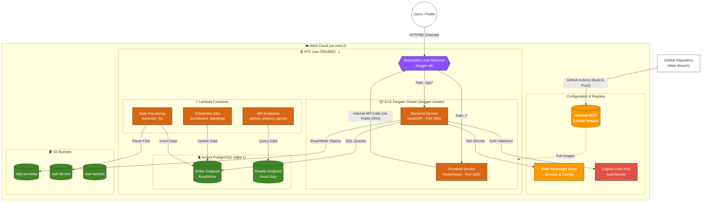

```mermaid
flowchart TB
    %% --- Styles ---
    classDef plain fill:#fff,stroke:#333,stroke-width:1px;
    classDef aws fill:#FF9900,stroke:#232F3E,color:white,font-weight:bold;
    classDef db fill:#3F8624,stroke:#232F3E,color:white;
    classDef compute fill:#D86613,stroke:#232F3E,color:white;
    classDef network fill:#8C4FFF,stroke:#232F3E,color:white;
    classDef security fill:#E05243,stroke:#232F3E,color:white;

    %% --- External Actors ---
    User((Users / Public)):::plain
    Devs["GitHub Repository<br/>(Main Branch)"]:::plain
    
    %% --- AWS Cloud Boundary ---
    subgraph AWS ["☁️ AWS Cloud (us-east-2)"]
        direction TB

        %% --- CI/CD & Configuration ---
        subgraph Config ["Configuration & Registry"]
            ECR[(Amazon ECR<br/>Docker Images)]:::aws
            SSM["SSM Parameter Store<br/>Secrets & Config"]:::aws
            Cognito["Cognito User Pool<br/>Auth/Identity"]:::security
        end

        %% --- VPC Boundary ---
        subgraph VPC ["🔒 VPC (vpc-030c8d61...)"]
            
            %% --- Load Balancer ---
            ALB{{"Application Load Balancer<br/>slugger-alb"}}:::network
            
            %% --- ECS Cluster ---
            subgraph ECS ["📦 ECS Fargate Cluster (slugger-cluster)"]
                direction TB
                FE["Frontend Service<br/>Node/React - Port 3000"]:::compute
                BE["Backend Service<br/>Node/API - Port 3001"]:::compute
            end

            %% --- Lambda Layer ---
            subgraph Serverless ["⚡ Lambda Functions"]
                L_API["API Endpoints<br/>pitches, players, games"]:::compute
                L_Jobs["Scheduled Jobs<br/>scoreboard, standings"]:::compute
                L_Data["Data Processing<br/>trackman_ftp"]:::compute
            end

            %% --- Database Layer ---
            subgraph RDS ["🛢️ Aurora PostgreSQL (alpb-1)"]
                Writer[(Writer Endpoint<br/>Read/Write)]:::db
                Reader[(Reader Endpoint<br/>Read Only)]:::db
            end
        end

        %% --- S3 Storage (Global/Region level) ---
        subgraph Storage ["🪣 S3 Buckets"]
            S3_JSON[("alpb-jsondata")]:::db
            S3_FTP[("alpb-ftp-test")]:::db
            S3_Lambda[("alpb-lambda")]:::db
        end
    end

    %% --- Relationships & Flows ---

    %% 1. CI/CD Flow
    Devs -- "GitHub Actions (Build & Push)" --> ECR
    ECR -. "Pull Images" .-> ECS

    %% 2. User Traffic Flow
    User -- "HTTP/80 (Internet)" --> ALB
    
    %% 3. ALB Routing Logic
    ALB -- "Path: /*" --> FE
    ALB -- "Path: /api/*" --> BE

    %% 4. Backend Dependencies
    BE -- "SQL Queries" --> Writer
    BE -- "Get Secrets" --> SSM
    BE -- "Auth Validation" --> Cognito
    BE -- "Read/Write Objects" --> S3_JSON

    %% 5. Lambda Interactions
    L_API -- "Query Data" --> Reader
    L_Jobs -- "Update Data" --> Writer
    L_Data -- "Parse Files" --> S3_FTP
    L_Data -- "Insert Data" --> Writer

    %% 6. Internal Service Comms
    FE -- "Internal API Calls (via Public DNS)" --> ALB
```